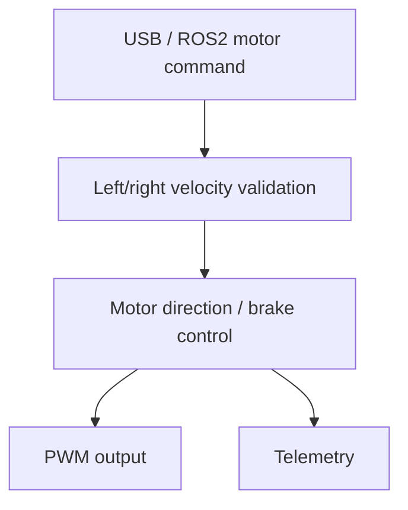

# Differential-Drive Motor Control

This module controls the differential-drive motors using direct left and right wheel velocity commands. It validates the requested velocity limits and handles PWM, direction, and brake output sequencing.

## Architecture

Velocity commands are accepted only when both values are finite and within
`DIFF_DRIVE_MAX_SPEED_MPS`. A zero command sets both PWM duties to zero and
asserts both brakes. Encoder-based closed-loop velocity control can be added
later.

## Public motor API

| API | Purpose |
| --- | --- |
| `motor_set(left, right)` | Validate and submit a wheel velocity command |
| `motor_get(left, right)` | Read the currently applied wheel velocities |
| `motor_set_monitor_callback(callback)` | Register the diagnostic monitor callback |

## Configuration

The main motor parameters are defined in `main/config/config.h`:

- `DIFF_DRIVE_MAX_SPEED_MPS`: per-wheel velocity capability limit;
- `DIFF_DRIVE_COMMAND_TIMEOUT_MS`: time without a valid command before both
  motors stop automatically (currently 500 ms).
